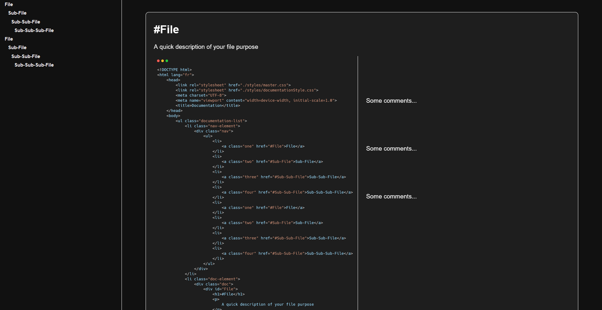

# Dark Documentation

Dark Documentation is a simple & light documentation for you codes.

## Installation:

Clone or download the repo

## To ScreenShot your code:

Use carbon, to create nice screenshots of your code, using this link to improve the readability of the final file:

https://carbon.now.sh/?bg=rgba%28171%2C184%2C195%2C0%29&t=vscode&wt=none&l=text%2Fx-go&ds=false&dsyoff=20px&dsblur=68px&wc=true&wa=true&pv=0px&ph=0px&ln=false&fl=1&fm=Hack&fs=18px&lh=133%25&si=false&es=1x&wm=false&code=